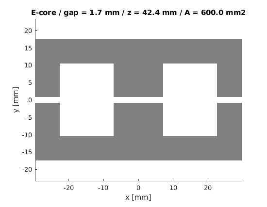
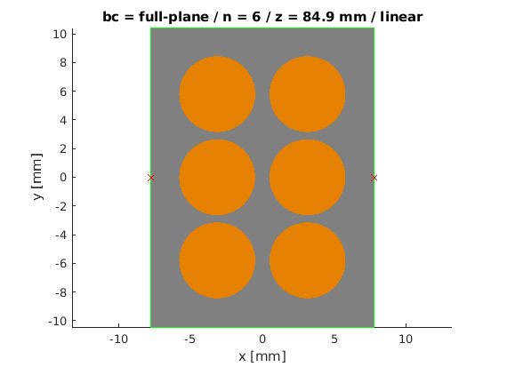
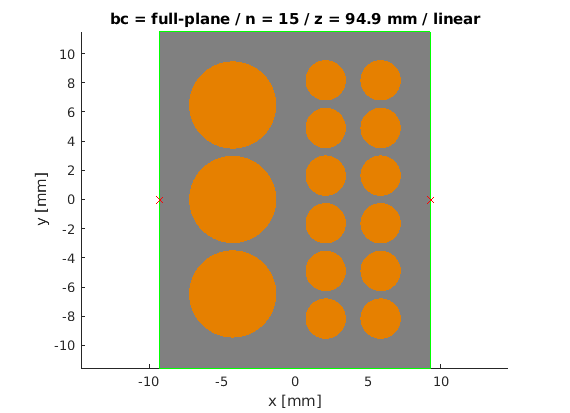

# MATLAB Toolbox for Power Magnetic Optimization

This **MATLAB tooblox** allows for the **modeling and optimization** of power **magnetic components**:
* medium-frequency **inductors**
* medium-frequency **transformers**
* computation of the **mass and volume**
* extraction of the **equivalent circuit**
* computation of the **core and winding losses**
* brute-force **optimization** (parallel code)
* flexible **object-oriented** design

The following methods/functionalities are provided for the **core modeling**:
* iGSE for the core losses (with locally fitted parameters from a loss map)
* reluctance solver with 3D air gap models
* multiple air gaps are allowed
* multiphases components are allowed

The following methods/functionalities are provided for the **winding modeling**:
* mirroring method with inductance matrix and field evaluation (with/without air gaps)
* solid wire windings (including skin and proximity losses)
* litz wire windings (including skin and proximity losses)
* multiple air gaps are allowed
* multiphases components are allowed
* model of the winding heads

Curently, the following **components are implemented**:
* inductors and two-winding transformers with shell-type windings
* U-core, C-core, and E-core

However, the object-oriented design would allow an extension for:
* multiphase transformers and multiphase chokes
* other winding geometries (core-type, matrix, etc.)
* other core geometries (ELP, RM, etc.)
* thermal models

## Gallery

    
    

    
    

    
    

## Getting Started

The MF transformer of a DC-DC converter is considered as an example.
The resonant converter (SRC-DCX) is operating between 400V and 100W with a rated power of 5kW.
The transformer geometry (core and windings) and the operating frequency are optimized.

The example consists of the following files:
*[run_1_src_dcx_single.m](run_1_src_dcx_single.m) - modelization of a single transformer
*[run_2_src_dcx_combine.m](run_2_src_dcx_combine.m) - brute-force optimization of the transformer
*[run_3_src_dcx_plot.m](run_3_src_dcx_plot.m) - optimization results (Pareo fronts)
*[src_dcx_example.m](src_dcx_example.m) - definition of the parameters, materials, and waveforms

## Toolbox Organization

The power magnetic toolbox contains the following packages:
* [core](magnetic_toolbox/core) - core reluctance and core losses
    * [core/README.txt](magnetic_toolbox/core/README.txt) - package documentation
    * [core/DATA_STRUCT.txt](magnetic_toolbox/core/DATA_STRUCT.txt) - data format documentation
    * [core/core_class.m](magnetic_toolbox/core/core_class.m) - main class
    * [core/core_lib](magnetic_toolbox/core/core_lib) - package internal classes
    * [core/core_example](magnetic_toolbox/core/core_example) - example/test files
* [window](magnetic_toolbox/window) - winding window stray field and winding losses
    * [window/README.txt](magnetic_toolbox/window/README.txt) - package documentation
    * [window/DATA_STRUCT.txt](magnetic_toolbox/window/DATA_STRUCT.txt) - data format documentation
    * [window/window_class.m](magnetic_toolbox/window/window_class.m) - main class
    * [window/window_lib](magnetic_toolbox/window/window_lib) - package internal classes
    * [window/window_example](magnetic_toolbox/window/window_example) - example/test files
* [component](magnetic_toolbox/component) - simulation of complete components (inductor or transformer)
    * [component/README.txt](magnetic_toolbox/component/README.txt) - package documentation
    * [component/DATA_STRUCT.txt](magnetic_toolbox/component/DATA_STRUCT.txt) - data format documentation
    * [component/component_class.m](magnetic_toolbox/component/component_class.m) - main class
    * [component/component_lib](magnetic_toolbox/component/component_lib) - package internal classes
    * [component/component_example](magnetic_toolbox/component/component_example) - example/test files
* [sweep](magnetic_toolbox/sweep) - simulation of design sweeps (brute-force optimization)
    * [sweep/README.txt](magnetic_toolbox/sweep/README.txt) - package documentation
    * [sweep/get_sweep_single.m](magnetic_toolbox/sweep/get_sweep_single.m) - simulating a single parameter combination
    * [sweep/get_sweep_combine.m](magnetic_toolbox/sweep/get_sweep_combine.m) - simulating a many parameter combinations
    * [sweep/sweep_lib](magnetic_toolbox/sweep/sweep_lib) - package internal functions
    * [sweep/sweep_example](magnetic_toolbox/sweep/sweep_example) - example/test files

## Compatibility

* Tested with MATLAB R2015b and R2021a.
* Parallel Computing Toolbox.
* Compatibility with GNU Octave not tested but probably problematic.

## Author

**Thomas Guillod** - [GitHub Profile](https://github.com/otvam)

## License

This project is licensed under the **BSD License**, see [LICENSE.md](LICENSE.md).

This project shares some files with the following repositories:
* [mirroring_method_matlab](https://github.com/ethz-pes/mirroring_method_matlab) - BSD License
* [litz_wire_losses_fem_matlab](https://github.com/ethz-pes/litz_wire_losses_fem_matlab) - BSD License
